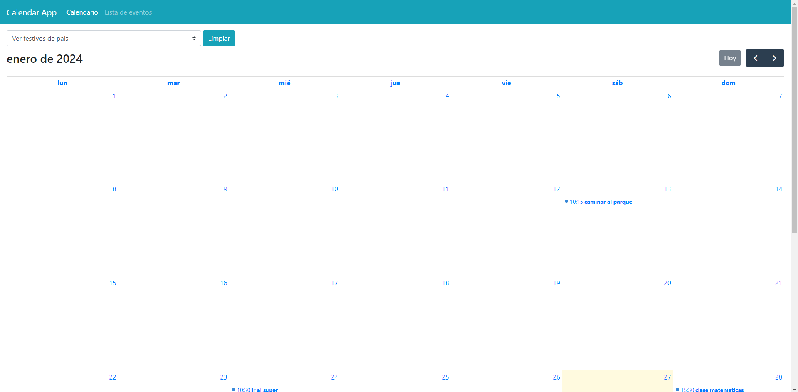

# Vue Calendar App

## Descripción

Vue Calendar App es una aplicación de calendario desarrollada con Vue.js que permite a los usuarios agregar notas, verlas en el calendario y consultar días festivos de un país mediante una API externa.

## Características

- **Agregar Notas:** Los usuarios pueden agregar notas a fechas específicas del calendario.
- **Visualización de Notas:** Las notas se muestran de manera intuitiva en el calendario.
- **Días Festivos:** La aplicación consulta una API externa para obtener los días festivos del país seleccionado y los muestra en el calendario.

## Tecnologías Utilizadas

- Vue.js
- Vuex (para la gestión del estado)
- Vue Router (para la navegación)
- FullCalendar (para la representación visual del calendario)
- BootstrapVue (para estilos y componentes Bootstrap)

## Instalación

1. Clonar el repostiorio `git clone https://github.com/jairayafranco/prueba-kawak.git`

2. Ingresar a la carpeta `cd prueba-kawak`

3. Instalar dependencias `npm install`

4. Ejecutar el proyecto `npm run dev`

5. Dirigirse a la URL `http://localhost:5173/`

